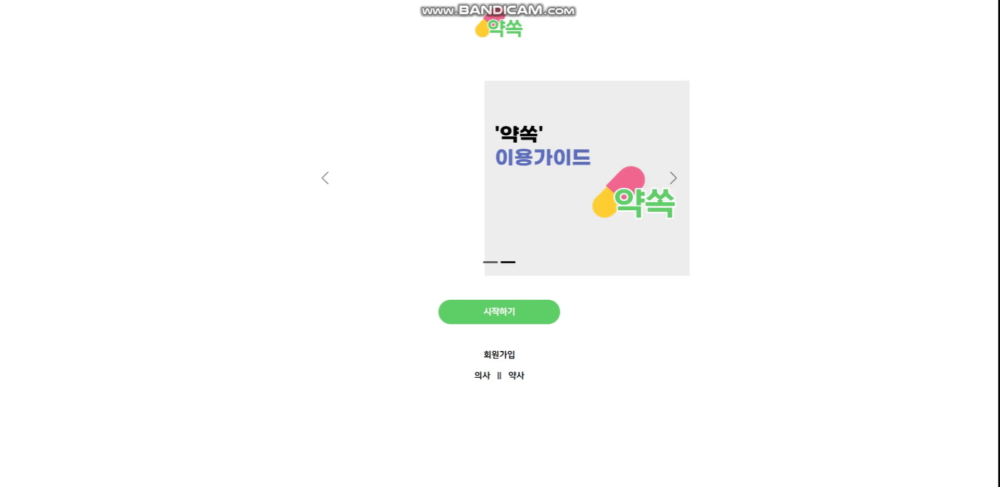
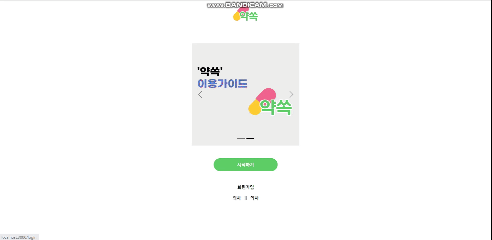
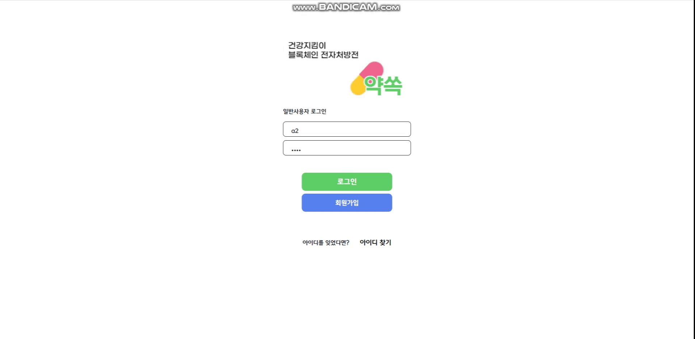
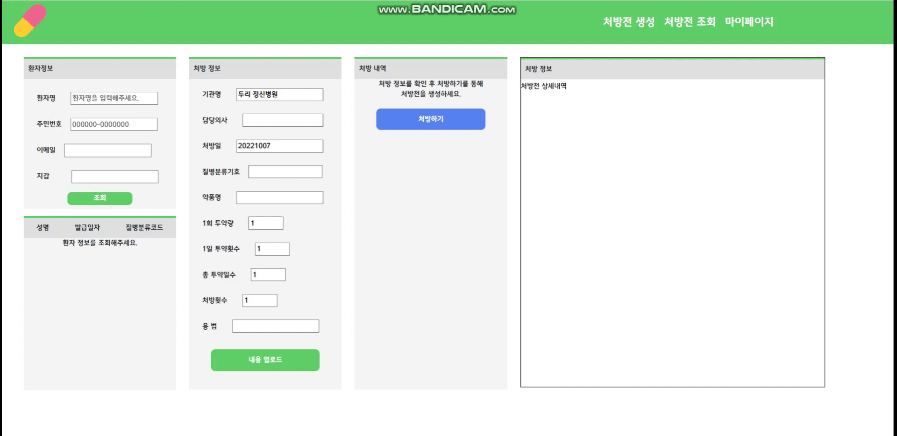
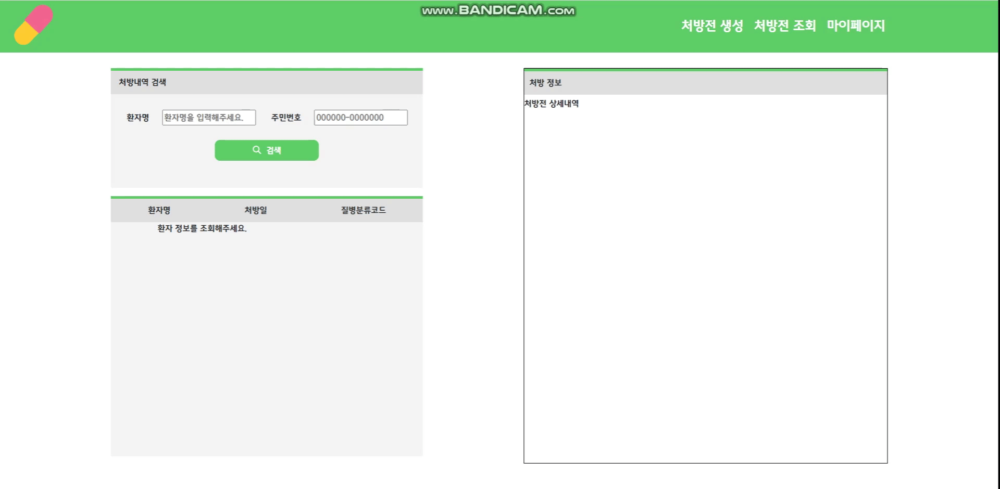
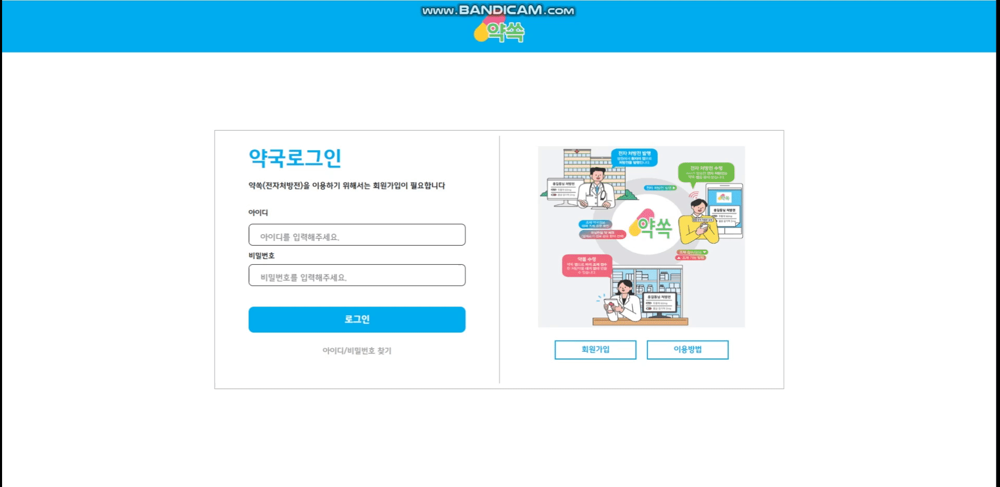

# 💊약쏙

## 목차

---

1. 프로젝트 소개

2. 기술스택

3. 주요 기능

4. 산출물

5. 프로젝트 결과물

## ✔개요

---

> 기존의 종이 처방전 프로세스를<u> **블록체인 토큰 기술을 적용한 전자 처방전**</u>으로 대체함으로써 의사, 약사, 보험사, 환자의 편리성과 효율성 상승 시키기

#### <의사>

- 대량 처방 안정성 보장
  
  - 처방 횟수를 입력함으로써 대량 처방 생성시 기간 및 횟수 입력 처방 가능

- 중복 처방 과정 효율성
  
  - 이전 처방 기록을 활용하여 반복 처방 가능

#### <약사>

- 접수 프로세스 효율성 개선
  
  - 종이 처방전 보관 및 관리 부담 해소
  
  - 처방전 선(先)수신을 통해 효율적인 운영 가능
  
  - 환자들이 원하는 시간 픽업을 통해 복잡도를 낮추어 환자 간의 접촉을 피할 수 있도록 함 ⇒ 질병 감염 위험도 하락

- 약국 방문 고객 관리
  
  - 약국도 사업의 일환으로 환자들의 방문 횟수 데이터를 바탕으로 약국 운영 계획 수립 가능

#### <환자>

- 불필요한 진료 시간 단축
  
  - 중복 처방일 경우, 기존 처방전을 토대로 재처방 가능

- 약국 대기 시간 단축
  
  - 픽업 신청으로 약국 픽업 시간 지정 가능

- 처방 내역 인지 가능
  
  - 처방된 약 히스토리 확인 가능
  
  - 부작용 및 주의해야 할 약 성분에 대한 인지 가능

- 원하는 약국으로 조제 신청 가능
  
  - 환자가 약국을 선택할 권리 보장

- 보험 청구 편리
  
  - 처방전의 해쉬 주소를 보험사에 바로 전송

- 처방 개인 정보 보호
  
  - 고유식별정보, 민감정보 보호 가능

#### <보험사>

- 보험 신청 프로세스 단축 및 확인 효율화
  
  - 처방전의 해쉬 주소만으로 직접 처방전 조회 가능
  
  - 필요한 정보만 확인 가능

- 보험 신청 조작 불가
  
  - 블록체인 기술로 기록은 불변하기 때문에 처방전 조작이 불가하므로 보험비 조작 및 과다 청구 발생 예방

## ✔개발 기간

---

##### 2022.08.30 ~ 10.07

## ✔팀원

---

| **이름** | **김민철**        | **김가흔**              | **김준구**            | **장원석**  | **조찬홍**       |
|:------:|:--------------:|:--------------------:|:------------------:|:--------:|:-------------:|
| **역할** | <u>팀장</u>/BL   | 부팀장/FE               | FE                 | BL       | BE            |
| **내용** | 스마트 컨트랙트   | 기획 및 발표 UX/UI 구성 | API 연결 Web3.js | 스마트 컨트랙트 | Server DB |

## ✔ 기술스택

---

#### IDE

| IntelliJ | VS Code | UI/UX |
|:--------:|:-------:|:-----:|
| 2022.2.1 | 1.70.1  | Figma |

#### Front-end

| HTML5 | CSS3 | React   | Node.js  | Web3.js |
|:-----:|:----:|:-------:|:--------:|:-------:|
| -     | -    | v18.0.0 | v16.16.0 | v1.7.4  |

#### Back-end

| Spring Boot | Open JDK | Gradle |
|:-----------:|:--------:|:------:|
| v2.7.2      | v8       | v6.7   |

#### Blockchain

| Solidity | Truffle | Ganache |
|:--------:|:-------:|:-------:|
| v0.5.16  | v5.5.29 | v7.4.0  |

#### DevOps

| NGINX | AWS EC2 Ubuntu | Jenkins | Docker   |
|:-----:|:--------------:|:-------:|:--------:|
| -     | 20.04 LTS      | 2.60.3  | 20.10.17 |

#### DataBase

| MySQL   |
|:-------:|
| 80.0.30 |

---

a.     OS: Windows 10

b.     IDE

    i.    IntelliJ 2022.2.1

    ii.    VisualStudio Code 1.70.1

    iii.    UI/UX: Figma

c.     DataBase

    i.    MySQL 8.0.30

d.     Server

    i.    AWS EC2 Ubuntu 20.04 LTS

e.     Dev-Ops

    i.    Docker 20.10.17

    ii.    Jenkins 2.60.3

f.      상세 사용

      i. **FrontEnd**

            1. HTML5,CSS3, JavaScript(ES6)

            2. React 18

            3. Node.js 16.16.0

            4. Web3.js v1.7.4

      ii. **BackEnd**

            1. Springboot 2.7.2

            2. OpenJDK 8

            3. Gradle 6.7

       **iii.**    **BlockChain**

            1. Truffle v5.5.29

            2. Ganache v7.4.0

            3. Solidity v0.5.16

## ✔ 주요기능

--- 

##### 📃전자처방전

- 의사 : 전자처방전 생성

- 환자 : 처방전 조회 및 이력 확인 / 보험사로 전자처방전 전달

- 약사 : 전자처방전 조회 및 관리

- 보험사 : 보험 청구 접수된 환자의 처방전 조회 및 확인

##### 🔔조제 접수 및 알림

- 환자 : 약국 조회 / 조제 원하는 처방전 선택 후 원하는 약국으로 조제 접수 / 수령 관련 방법 선택 / 조제 접수 완료 알림

- 약사 : 조제 접수된 환자의 처방전 조회 / 조제 접수 완료 알림 전송

## ✔ 서비스 아키텍처

---

## ✔ 서비스 흐름도

---

## ✔ 서비스 화면

---

