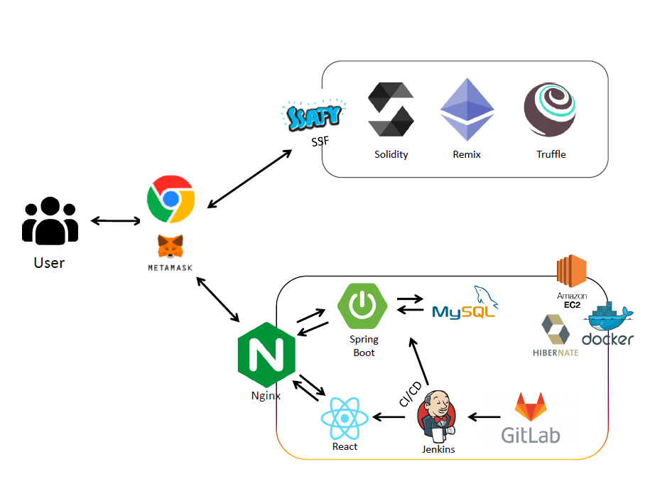
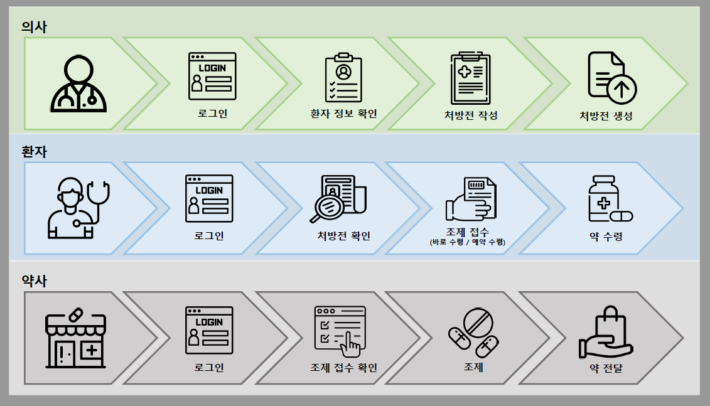

# 💊약쏙

## 

## ✔개요

---

> 기존의 종이 처방전 프로세스를<u> 블록체인 토큰 기술을 적용한 전자 처방전</u>으로 대체함으로써 의사, 약사, 보험사, 환자의 편리성과 효율성 상승 시키기

| 대상     | 의사                                                                                                                                                              | 약사                                                                                                                                                                                                            | 환자                                                                                                                                                                                                                                                                                                          | 보험사                                                                                                                                                              |
| ------ | --------------------------------------------------------------------------------------------------------------------------------------------------------------- | ------------------------------------------------------------------------------------------------------------------------------------------------------------------------------------------------------------- | ----------------------------------------------------------------------------------------------------------------------------------------------------------------------------------------------------------------------------------------------------------------------------------------------------------- | ---------------------------------------------------------------------------------------------------------------------------------------------------------------- |
| **내용** | - 대량 처방 안정성 보장 :  처방 횟수를 입력함으로써 대량도 기간 및 횟수로 처방 가능 - 중복 처방 과정 효율성 :  이전 처방 기록을 활용하여 반복 처방 가능 - 환자의 처방 내역 확인:  이전 처방 내역을 바탕으로 환자에게 올바른 처방 가능 | - 접수 프로세스 효율성 개선:   종이 처방전 보관 및 관리 부담 해소 처방전 선(先)수신을 통해 효율적인 운영 가능 환자들이 원하는 시간 픽업을 통해 복잡도를 낮추어 환자 간의 접촉을 피할 수 있도록 함 ⇒ 질병 감염 위험도 하락 - 고객 관리 가능:  약국도 사업의 일환으로 환자들의 방문 횟수를 바탕으로 운영 계획 수립 가능 | - 불필요한 진료 시간 단축:  중복 처방일 경우 기존 처방으로 처방 가능  - 약국 대기 시간 단축:  픽업 신청으로 약국 픽업 시간 지정 가능  - 처방 내역 인지 가능:  처방된 약 히스토리 확인 가능 부작용 및 주의해야 할 약 성분에 대한 인지 가능 - 원하는 약국으로 조제 신청 가능:  환자가 약국을 선택할 권리 보장 -  보험 청구 편리:   처방전의 해쉬 주소를 보험사에 전송  -처방 정보 보호:   고유식별정보, 민감정보 보호 가능 | - 보험 신청 프로세스 단축 및 확인 효율화:  처방전의 해쉬 주소만으로 직접 처방전 조회 가능   필요한 정보만 확인 가능  - 보험 신청 조작 불가:   블록체인 기술로 기록은 불변하기 때문에 처방전 조작이 불가하므로 보험비 조작 및 과다 청구 발생 예방 |

## ✔개발 기간

---

2022.08.30 ~

## ✔팀원

---

| **이름** | **김민철**                 | **김가흔** | **김준구** | **장원석**       | **조찬홍**       |
|:------:|:-----------------------:|:-------:|:-------:|:-------------:|:-------------:|
| **역할** | <u>팀장</u>,BE,Blockchain | 부팀장,FE  | FE      | BE,Blockchain | BE,Blockchain |
| **내용** | 스마트 컨트랙트 생성             |         |         |               |               |

## ✔ 기술스택

---

#### Front-end

|       |      |       |     |         |
|:-----:|:----:|:-----:|:---:|:-------:|
| HTML5 | CSS3 | React | MUI | Web3.js |

#### Back-end

|      |             |       |
|:----:|:-----------:|:-----:|
| Java | Spring Boot | MySQL |

#### Blockchain

|          |         |             |
|:--------:|:-------:|:-----------:|
| Solidity | Truffle | OpenZepplin |

#### DevOps

|       |     |         |        |
|:-----:|:---:|:-------:|:------:|
| NGINX | AWS | Jenkins | Docker |

## ✔ 주요기능

---

##### 📃전자처방전

- 의사 : 전자처방전 생성

- 환자 : 처방전 조회 및 이력 확인 / 보험사로 전자처방전 전달

- 약사 : 전자처방전 조회 및 관리

- 보험사 : 보험 청구 접수된 환자의 처방전 조회 및 확인

##### 🔔조제 접수 및 알림

- 환자 : 약국 조회 / 조제 원하는 처방전 선택 후 원하는 약국으로 조제 접수 / 수령 관련 방법 선택 / 조제 접수 완료 알림

- 약사 : 조제 접수된 환자의 처방전 조회 / 조제 접수 완료 알림 전송

## ✔ 서비스 아키텍처

---

## ✔ 서비스 흐름도

---

## ✔ 서비스 화면

---
